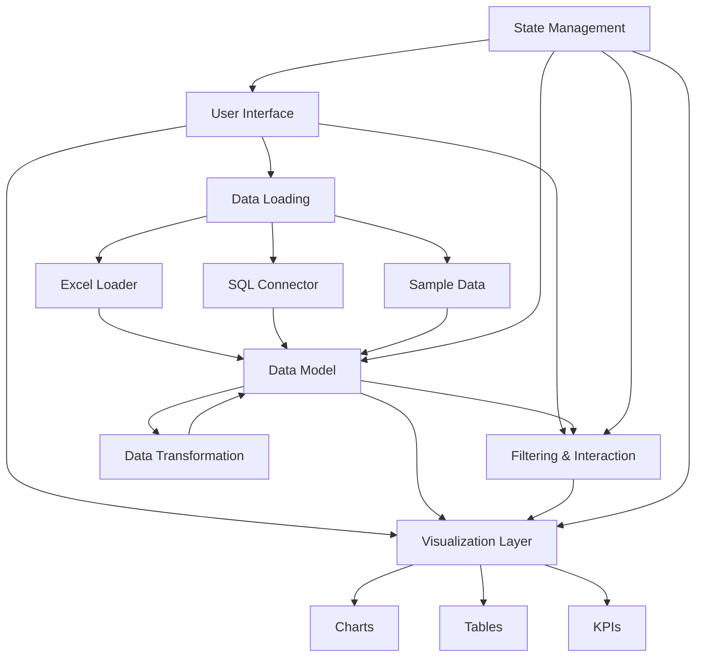

# Power BI Clone Architecture Plan

## Architecture Overview

Here's a high-level architecture diagram for the updated Power BI clone:

## Component Structure

1. **Core Components**
   - **DataContext**: Central state management using React Context API
   - **DataModel**: Handles data schema, relationships, and measures
   - **VisualizationManager**: Manages visualization creation and configuration

2. **Data Loading Components**
   - **FileUploader**: Handles Excel file uploads
   - **ExcelParser**: Parses Excel files into usable data
   - **SQLConnector**: Manages SQL database connections
   - **QueryBuilder**: Interface for building SQL queries
   - **DataPreview**: Shows preview of loaded data

3. **Data Transformation Components**
   - **DataTable**: Displays and allows editing of data
   - **ColumnTypeEditor**: Changes data types of columns
   - **FormulaEditor**: Creates calculated columns and measures
   - **DataFilterPanel**: Filters data before visualization

4. **Visualization Components**
   - **ChartComponent**: Base component for all charts
   - **BarChart**, **LineChart**, **PieChart**: Specific chart implementations
   - **DataTable**: Tabular data display
   - **KPICard**: Shows key performance indicators
   - **VisualizationProperties**: Configures visualization settings

5. **Interaction Components**
   - **FilterPanel**: Creates and manages filters
   - **DateRangePicker**: Specialized date filtering
   - **CrossFilterManager**: Handles interactions between visualizations
   - **DrillDownManager**: Manages drill-down functionality

6. **Layout Components**
   - **DashboardCanvas**: Main workspace for visualizations
   - **VisualizationContainer**: Wrapper for individual visualizations
   - **GridLayout**: Manages positioning and sizing of visualizations

## Data Flow

1. **Data Loading**:
   - User selects data source (Excel, SQL, Sample)
   - Data is loaded and parsed into a standardized format
   - Preview is shown to the user for confirmation

2. **Data Transformation**:
   - User can modify data types, create calculated columns
   - Data is transformed according to user specifications
   - Changes are reflected in the data model

3. **Visualization Creation**:
   - User selects visualization type
   - User configures visualization properties (axes, colors, etc.)
   - Visualization is rendered based on selected data and properties

4. **Interaction**:
   - User applies filters to data
   - Filters affect all relevant visualizations
   - User can drill down into data for more detail
   - Cross-filtering allows interactions between visualizations

## State Management

We'll use React Context API for state management with the following contexts:

1. **DataContext**: Manages loaded datasets and their schemas
2. **VisualizationContext**: Manages visualization configurations
3. **FilterContext**: Manages global and local filters
4. **UIContext**: Manages UI state (selected tabs, panels, etc.)

## Implementation Approach

We'll implement this project in phases:

### Phase 1: Foundation
- Set up state management with Context API
- Implement basic data loading for Excel files
- Create simple data preview component
- Add basic chart components (bar, line, pie)

### Phase 2: Enhanced Data Handling
- Add SQL database connectivity
- Implement data transformation interface
- Create calculated columns functionality
- Add sample data for testing

### Phase 3: Advanced Visualization
- Implement interactive charts with filtering
- Add cross-filtering between visualizations
- Create visualization property panel
- Implement drill-down functionality

### Phase 4: Layout and Polish
- Implement drag and drop for visualizations
- Add resizing capabilities
- Create dashboard saving/loading
- Polish UI and add final touches

## Required Libraries

1. **Data Processing**:
   - xlsx: For Excel file parsing
   - sql.js: For SQL database support
   - papaparse: For CSV parsing

2. **Visualization**:
   - recharts or chart.js: For chart visualizations
   - ag-grid or react-table: For data tables

3. **Layout**:
   - react-grid-layout: For dashboard layout
   - react-dnd: For drag and drop functionality

4. **Utilities**:
   - lodash: For data manipulation
   - date-fns: For date handling